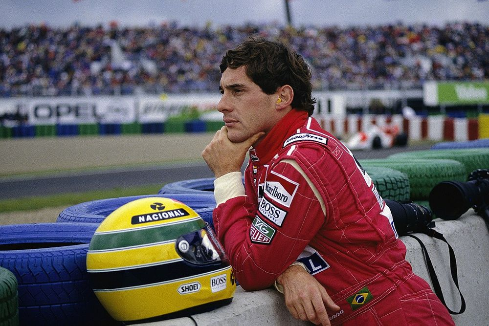

<head>
  <meta charset="UTF-8">
  <meta name="viewport" content="width=device-width, initial-scale=1.0">
  <title>Move F1 Car</title>
  
</head>
<body>

  <!-- F1 Car Image -->
  

  

</body>

As the highest class of international racing for single-seater formula racing cars, Formula 1 is the pinnacle of motorsport and the world’s most prestigious motor racing competition. There really is nothing like it.

It’s a team sport (it needs to be to change all 4 tyres on a car in under 2 seconds!), but the drivers are more like fighter pilots than sportspeople. Battling extreme g-forces, making daring decisions in the blink of an eye – and at 370km/h. To be the best, F1 drivers push themselves – and their incredibly innovative machines – to the very limit.

Drivers compete for the esteemed F1 Drivers’ Championship, while the teams fight for the F1 Constructors’ Championship and prize money based on their position at the end of the season.

Each race is known as a Grand Prix, and they’re held in incredible locations around the world. 2024 will feature a record-breaking number of Grand Prix events, with 24 races set to take place this season.

<head>
  <h2> My favourite drivers of all time </h2>
</head>
(I haven't been able so watch them all live since I wasn't born yet but I've watched video recordings of their past races and achievements)
<head>
  <meta charset="UTF-8">
  <meta name="viewport" content="width=device-width, initial-scale=1.0">
  
</head>
<body>

  

    

      
      
Michael Schumacher

    

    

      
      
Ayrton Senna

    

    

      
      
Fernando Alonso

    

  

</body>

Source:
<a href="https://www.formula1.com/en/latest/article/drivers-teams-cars-circuits-and-more-everything-you-need-to-know-about.7iQfL3Rivf1comzdqV5jwc">What You Need to Know About F1</a>